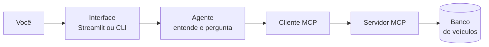

# mcp_auto – Busca de Veículos (Desafio C2S)

## Arquitetura (visão geral)



A resposta volta pelo mesmo caminho: banco → servidor → cliente → agente → interface → você.

---

- **Modelagem**: `src/domain/models.py` (SQLModel, 11 atributos).
- **Seed**: `python scripts/seed_vehicles.py` (100+ veículos, Faker).
- **MCP**: Servidor FastMCP em `src/infrastructure/mcp_server.py` (tool `search_vehicles`). Cliente em `src/application/mcp_client.py`. Fluxo Client → Server → DB.
- **Agente**: LangChain + LiteLLM em `src/application/agent.py`; conversa natural, pergunta filtros, chama a tool e exibe marca, modelo, ano, cor, quilometragem e preço.
- **UI**: Streamlit em `app_streamlit.py`. Demo em `notebooks/demo.ipynb`.

## Como rodar

```bash
# ambiente
pip install -e .

# popular banco (obrigatório antes de usar)
python scripts/seed_vehicles.py

# app
streamlit run app_streamlit.py
```

Para o notebook: abra `notebooks/demo.ipynb`, execute as células (seed + agente + exemplos de conversa e chamada direta ao MCP).

**Variável de ambiente**: para o LiteLLM (ex.: OpenAI), configure `OPENAI_API_KEY` ou o provider que for usar.
